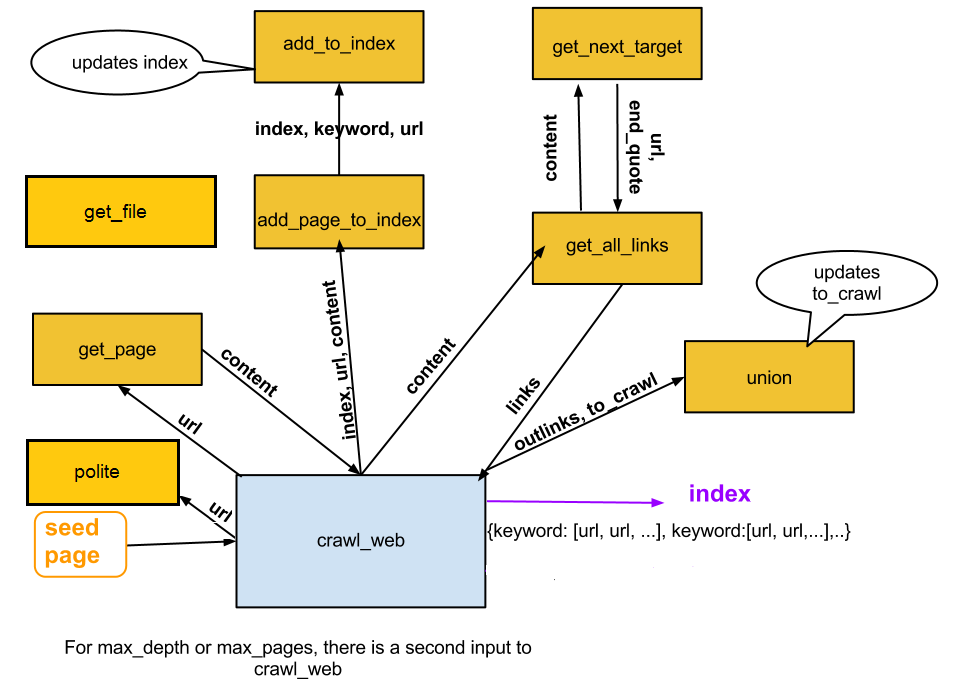

Crawler
================

## Features
- Maximum crawling depth, pages
- Repects robots.txt

The overall dataflow for the crawling processing looks like:



## Requirements
- Python v2.7+
- [BeautifulSoup](http://www.crummy.com/software/BeautifulSoup/)
- [Robot Exclusion Rules](http://nikitathespider.com/python/rerp/)

## Usage

```
python crawler.py
```

## Reference

The building of this crawler follows instructions from [CS101 in Udacity](https://www.udacity.com/course/viewer#!/c-cs101) and [DaveDaveFind](http://davedavefind.appspot.com/).

Auto
================

## Requirements
- Python v2.7+
- [Python for Windows extensions](http://sourceforge.net/projects/pywin32/)

## Usage

- Need to modify the location of the file

- Currently can run [python-2.7.5.msi](http://python.org/ftp/python/2.7.5/python-2.7.5.msi) and click the first 'Next' button.

## Reference

The automation is based on [Simon Brunning's winGuiAuto.py](http://www.brunningonline.net/simon/blog/archives/winGuiAuto.py.html)